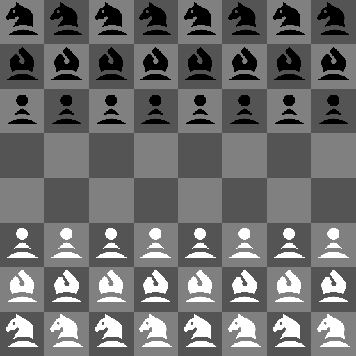

# Longbow
Warband chess variant

## Game rules

Warbands comprise:

* P: infantry (pawns)
* B: archers (bishops)
* N: knights.

These move and capture like they do in regular chess, although
archers can shoot/move through rank and file, even if occupied,
but only if the move kills an enemy.

Promote infantry to win the game.

If no infantry are left, the game is a draw.

Moves are made using the coordinate notation e.g. a3a4.

White pieces are shown in uppercase (P,B,N) and black pieces in lowercase (p,b,n).

## Install and run

To install, clone this repo, change to the directory and run:

```bash
nimble build
```

This will install any needed libraries and build a **longbow** executable. Simply run that executable in a terminal/shell to play.

Parameters include:
  * -h   : help
  * -b   : play as black (default = false)
  * -f   : flip board (default = false)
  * -d:x : where x is depth of search (default = 5)

The depth of search is measured in plies. One ply is a single play. So, one full round of play between two players is two plies.

./longbox -bd:7 plays as black with a depth of 7.

## Credits

This code uses John Dupuy's excellent turn_based_game and negamax nim modules:

https://github.com/JohnAD/turn_based_game

https://github.com/JohnAD/negamax

## GUI's
 * https://github.com/freevryheid/longbow-gui




